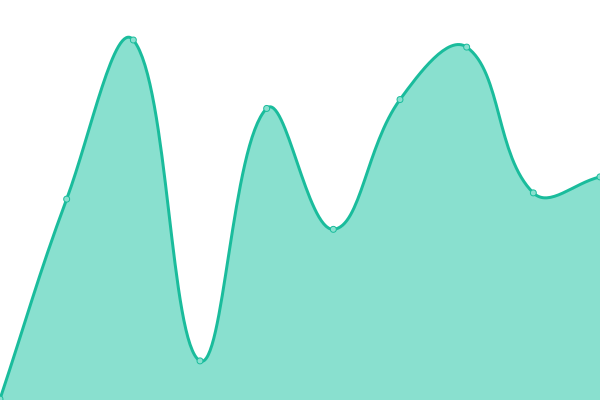
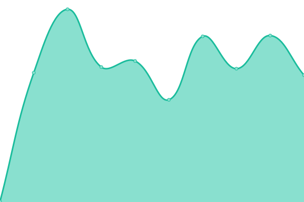

# [📈 Live Status](https://status.xnaas.info): <!--live status--> **🟩 All systems operational**

This repository contains the open-source uptime monitor and status page for [xnaas](https://xnaas.info/), powered by [Upptime](https://github.com/upptime/upptime).

With [Upptime](https://upptime.js.org), you can get your own unlimited and free uptime monitor and status page, powered entirely by a GitHub repository. We use [Issues](https://github.com/xnaas/status/issues) as incident reports, [Actions](https://github.com/xnaas/status/actions) as uptime monitors, and [Pages](https://status.xnaas.info) for the status page.

<!--start: status pages-->
<!-- This summary is generated by Upptime (https://github.com/upptime/upptime) -->
<!-- Do not edit this manually, your changes will be overwritten -->
<!-- prettier-ignore -->
| URL | Status | History | Response Time | Uptime |
| --- | ------ | ------- | ------------- | ------ |
|  [Homepage](https://xnaas.info) | 🟩 Up | [homepage.yml](https://github.com/xnaas/status/commits/HEAD/history/homepage.yml) | 

 461ms
     
 | 

<a href="https://status.xnaas.info/history/homepage">98.92%</a>
    

|  [Scrutiny](https://drive-status.xnaas.info) | 🟩 Up | [scrutiny.yml](https://github.com/xnaas/status/commits/HEAD/history/scrutiny.yml) | 

 530ms
     
 | 

<a href="https://status.xnaas.info/history/scrutiny">98.92%</a>
    

|  [thelounge](https://irc.xnaas.info) | 🟩 Up | [thelounge.yml](https://github.com/xnaas/status/commits/HEAD/history/thelounge.yml) | 

 264ms
     
 | 

<a href="https://status.xnaas.info/history/thelounge">98.92%</a>
    

|  [KB](https://kb.xnaas.info) | 🟩 Up | [kb.yml](https://github.com/xnaas/status/commits/HEAD/history/kb.yml) | 

 504ms
     
 | 

<a href="https://status.xnaas.info/history/kb">98.92%</a>
    

|  [Owncast](https://live.xnaas.info) | 🟩 Up | [owncast.yml](https://github.com/xnaas/status/commits/HEAD/history/owncast.yml) | 

 257ms
     
 | 

<a href="https://status.xnaas.info/history/owncast">98.93%</a>
    

|  [Music](https://music.xnaas.info) | 🟩 Up | [music.yml](https://github.com/xnaas/status/commits/HEAD/history/music.yml) | 

 345ms
     
 | 

<a href="https://status.xnaas.info/history/music">98.93%</a>
    

|  [Notes](https://notes.xnaas.info) | 🟩 Up | [notes.yml](https://github.com/xnaas/status/commits/HEAD/history/notes.yml) | 

 349ms
     
 | 

<a href="https://status.xnaas.info/history/notes">98.93%</a>
    

|  [Plex](https://plex.xnaas.info) | 🟩 Up | [plex.yml](https://github.com/xnaas/status/commits/HEAD/history/plex.yml) | 

 554ms
     
 | 

<a href="https://status.xnaas.info/history/plex">98.93%</a>
    

|  [PlexPy](https://plexpy.xnaas.info) | 🟩 Up | [plex-py.yml](https://github.com/xnaas/status/commits/HEAD/history/plex-py.yml) | 

 383ms
     
 | 

<a href="https://status.xnaas.info/history/plex-py">98.93%</a>
    

|  [Overseerr](https://request.xnaas.info) | 🟩 Up | [overseerr.yml](https://github.com/xnaas/status/commits/HEAD/history/overseerr.yml) | 

 473ms
     
 | 

<a href="https://status.xnaas.info/history/overseerr">98.93%</a>
    

|  [FreshRSS](https://rss.xnaas.info) | 🟩 Up | [fresh-rss.yml](https://github.com/xnaas/status/commits/HEAD/history/fresh-rss.yml) | 

 276ms
     
 | 

<a href="https://status.xnaas.info/history/fresh-rss">98.93%</a>
    

|  [TeslaMate](https://tesla.xnaas.info) | 🟩 Up | [tesla-mate.yml](https://github.com/xnaas/status/commits/HEAD/history/tesla-mate.yml) | 

 240ms
     
 | 

<a href="https://status.xnaas.info/history/tesla-mate">98.93%</a>
    

|  [Grafana](https://teslag.xnaas.info) | 🟩 Up | [grafana.yml](https://github.com/xnaas/status/commits/HEAD/history/grafana.yml) | 

 342ms
     
 | 

<a href="https://status.xnaas.info/history/grafana">98.93%</a>
    

<!--end: status pages-->

[**Visit our status website →**](https://status.xnaas.info)

## 📄 License

- Powered by: [Upptime](https://github.com/upptime/upptime)
- Code: [MIT](./LICENSE) © [xnaas](https://xnaas.info/)
- Data in the `./history` directory: [Open Database License](https://opendatacommons.org/licenses/odbl/1-0/)
