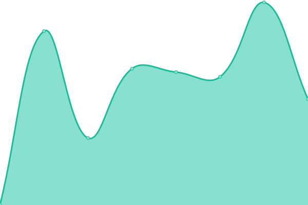
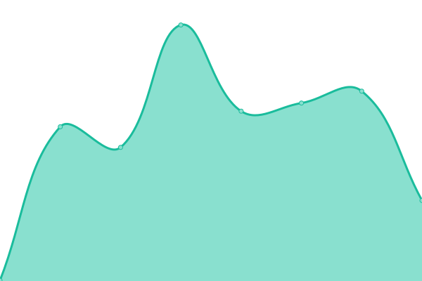

# [📈 Live Status](https://status.xnaas.info): <!--live status--> **🟧 Partial outage**

This repository contains the open-source uptime monitor and status page for [xnaas](https://xnaas.info/), powered by [Upptime](https://github.com/upptime/upptime).

With [Upptime](https://upptime.js.org), you can get your own unlimited and free uptime monitor and status page, powered entirely by a GitHub repository. We use [Issues](https://github.com/xnaas/status/issues) as incident reports, [Actions](https://github.com/xnaas/status/actions) as uptime monitors, and [Pages](https://status.xnaas.info) for the status page.

<!--start: status pages-->
<!-- This summary is generated by Upptime (https://github.com/upptime/upptime) -->
<!-- Do not edit this manually, your changes will be overwritten -->
<!-- prettier-ignore -->
| URL | Status | History | Response Time | Uptime |
| --- | ------ | ------- | ------------- | ------ |
|  [Homepage](https://xnaas.info) | 🟥 Down | [homepage.yml](https://github.com/xnaas/status/commits/HEAD/history/homepage.yml) | 

 250ms
     
 | 

<a href="https://status.xnaas.info/history/homepage">99.36%</a>
    

|  [thelounge](https://irc.xnaas.info) | 🟥 Down | [thelounge.yml](https://github.com/xnaas/status/commits/HEAD/history/thelounge.yml) | 

 258ms
     
 | 

<a href="https://status.xnaas.info/history/thelounge">99.36%</a>
    

|  [KB](https://kb.xnaas.info) | 🟥 Down | [kb.yml](https://github.com/xnaas/status/commits/HEAD/history/kb.yml) | 

 258ms
     
 | 

<a href="https://status.xnaas.info/history/kb">99.38%</a>
    

|  [Owncast](https://live.xnaas.info) | 🟥 Down | [owncast.yml](https://github.com/xnaas/status/commits/HEAD/history/owncast.yml) | 

 538ms
     
 | 

<a href="https://status.xnaas.info/history/owncast">99.40%</a>
    

|  [Navidrome](https://music.xnaas.info) | 🟥 Down | [navidrome.yml](https://github.com/xnaas/status/commits/HEAD/history/navidrome.yml) | 

 283ms
     
 | 

<a href="https://status.xnaas.info/history/navidrome">99.42%</a>
    

|  [Plex](https://plex.xnaas.info) | 🟩 Up | [plex.yml](https://github.com/xnaas/status/commits/HEAD/history/plex.yml) | 

 322ms
     
 | 

<a href="https://status.xnaas.info/history/plex">100.00%</a>
    

|  [PlexPy](https://plexpy.xnaas.info) | 🟥 Down | [plex-py.yml](https://github.com/xnaas/status/commits/HEAD/history/plex-py.yml) | 

 497ms
     
 | 

<a href="https://status.xnaas.info/history/plex-py">99.43%</a>
    

|  [Overseerr](https://request.xnaas.info) | 🟥 Down | [overseerr.yml](https://github.com/xnaas/status/commits/HEAD/history/overseerr.yml) | 

 310ms
     
 | 

<a href="https://status.xnaas.info/history/overseerr">99.45%</a>
    

|  [FreshRSS](https://rss.xnaas.info) | 🟥 Down | [fresh-rss.yml](https://github.com/xnaas/status/commits/HEAD/history/fresh-rss.yml) | 

 237ms
     
 | 

<a href="https://status.xnaas.info/history/fresh-rss">99.47%</a>
    

|  [TeslaMate](https://tesla.xnaas.info) | 🟥 Down | [tesla-mate.yml](https://github.com/xnaas/status/commits/HEAD/history/tesla-mate.yml) | 

 216ms
     
 | 

<a href="https://status.xnaas.info/history/tesla-mate">99.49%</a>
    

|  [Grafana](https://teslag.xnaas.info) | 🟥 Down | [grafana.yml](https://github.com/xnaas/status/commits/HEAD/history/grafana.yml) | 

 201ms
     
 | 

<a href="https://status.xnaas.info/history/grafana">99.51%</a>
    

<!--end: status pages-->

[**Visit our status website →**](https://status.xnaas.info)

## 📄 License

- Powered by: [Upptime](https://github.com/upptime/upptime)
- Code: [MIT](./LICENSE) © [xnaas](https://xnaas.info/)
- Data in the `./history` directory: [Open Database License](https://opendatacommons.org/licenses/odbl/1-0/)
